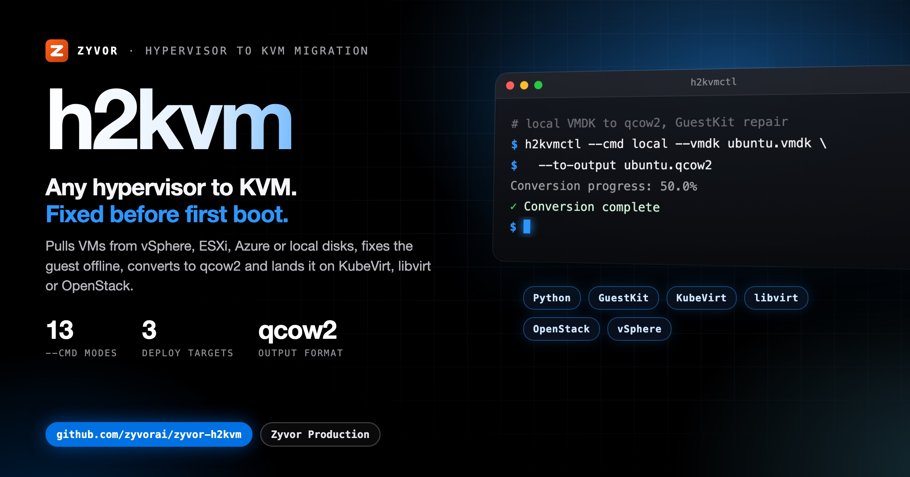
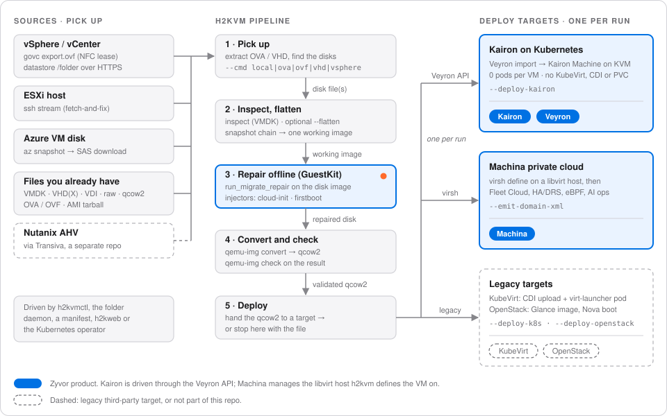

<div align="center">



# h2kvm

### Any hypervisor → KVM. Convert offline. Fix the guest. Deploy with confidence.

Pick up VMs from **vSphere, ESXi, Azure**, or any disk you already have (**VMDK, VHDX, VDI, raw, OVA/OVF**) —  
fix the guest offline, then land it on **KubeVirt, libvirt, or OpenStack**. Web control plane and Kubernetes operator included.

**First-boot science for hypervisor exit** · lands on KubeVirt (**[Zorvia](https://zyvor.dev/zorvia?utm_source=github&utm_medium=h2kvm&utm_campaign=readme_hero)** · **[Zeus OS](https://zyvor.dev/zeus-os?utm_source=github&utm_medium=h2kvm&utm_campaign=readme_hero)**), libvirt (**[Machina](https://zyvor.dev/machina?utm_source=github&utm_medium=h2kvm&utm_campaign=readme_hero)**) or OpenStack · part of the [Zyvor](https://zyvor.dev/?utm_source=github&utm_medium=h2kvm&utm_campaign=readme_hero) suite

**Production use needs a paid licence, and [pricing is public](https://zyvor.dev/pricing?utm_source=github&utm_medium=h2kvm&utm_campaign=readme_hero).** Free for evaluation, development and labs.

<br/>

[](https://github.com/zyvorai/zyvor-h2kvm/releases/latest)
[](https://pypi.org/project/zyvor-guestkit/)
[](https://www.python.org/)
[](LICENSE)

[](https://zyvor.dev/schedule?utm_source=github&utm_medium=h2kvm&utm_campaign=readme_hero)
[](https://zyvor.dev/poc?utm_source=github&utm_medium=h2kvm&utm_campaign=readme_hero)
[](https://www.youtube.com/watch?v=lQP1sd5Ftkc)

**[How it works](docs/how-it-works.md)** ·
**[Install](docs/install-and-quick-start.md#install)** ·
**[Quick start](#quick-start)** ·
**[GuestKit](docs/guestkit-integration.md)** ·
**[Demos](docs/demos.md)** ·
**[CE vs Enterprise](#community-vs-enterprise)** ·
**[Docs](docs/README.md)** ·
**[Product](https://zyvor.dev/h2kvm?utm_source=github&utm_medium=h2kvm&utm_campaign=readme_hero)**

</div>

---

<a id="how-it-works"></a>

## Fix it offline. Boot it the first time.

h2kvm picks up a disk from wherever the VM lives today, repairs the guest **offline** so it boots on KVM the first time, converts it to qcow2, and hands it to **one** deploy target. Nothing is powered on until the disk is fixed.

<div align="center">

<picture>
  <source media="(prefers-color-scheme: dark)" srcset="docs/social/h2kvm-flow-dark.svg">
  
</picture>

</div>

<table>
<tr>
<td valign="top" width="33%">
<b>Pick up from anywhere</b><br>
vSphere (govc, datastore, ovftool), ESXi over SSH, Azure, or any VMDK, VHD(X), OVA/OVF or raw file.<br>
<a href="docs/how-it-works.md#where-disks-come-from">Where disks come from</a>
</td>
<td valign="top" width="33%">
<b>Repair offline</b><br>
GuestKit fixes fstab, bootloader, initramfs and hypervisor-aware config before power-on; h2kvm injects cloud-init, first-boot, network, user, service and hostname config.<br>
<a href="docs/guestkit-integration.md">GuestKit in h2kvm</a>
</td>
<td valign="top" width="33%">
<b>Convert and check</b><br>
<code>qemu-img convert</code> to qcow2, then <code>qemu-img check</code> on the result. Or keep the file.<br>
<a href="docs/how-it-works.md#what-happens-to-the-disk">What happens to the disk</a>
</td>
</tr>
<tr>
<td valign="top" width="33%">
<b>Land it on KVM</b><br>
KubeVirt (<code>--deploy-k8s</code>), libvirt (<code>--emit-domain-xml</code>) or OpenStack (<code>--deploy-openstack</code>). One target per run.<br>
<a href="docs/how-it-works.md#where-the-vm-lands">Where the VM lands</a>
</td>
<td valign="top" width="33%">
<b>Web dashboard</b><br>
The h2kweb dashboard shows progress, with webhooks and email.<br>
<a href="docs/install-and-quick-start.md#quick-start">Quick start</a>
</td>
<td valign="top" width="33%">
<b>Operator and Helm</b><br>
A Kubernetes / OpenShift operator and production Helm charts.<br>
<a href="docs/install-and-quick-start.md#quick-start">Surfaces</a>
</td>
</tr>
</table>

---

<a id="install"></a>
<a id="quick-start"></a>
<a id="60-second-quick-start"></a>

## Quick start

```bash
pip install "h2kvm[guestkit]==1.4.0"

# Local VMDK → qcow2 (GuestKit repair is the default backend)
h2kvmctl --cmd local --vmdk ubuntu.vmdk --to-output ubuntu.qcow2 --backend guestkit

# vSphere → repair → KubeVirt (there are no subcommands; --cmd picks the mode)
h2kvmctl --cmd vsphere --vcenter vc.example.com --vc-user admin \
  --vc-password-env VC_PASSWORD --vs-vm web-prod-01 \
  --output-dir ./out --to-output web-prod-01.qcow2 --flatten \
  --deploy-k8s --k8s-namespace vms
```

Host needs Linux with `qemu-img`, `qemu-nbd`, and `losetup`. More: [install, artifacts and surfaces](docs/install-and-quick-start.md) · [remote lab deploy](docs/remote-lab-deploy.md) · [GuestKit](docs/guestkit-integration.md).

<a id="guestkit"></a>
<a id="remote-lab-deploy"></a>
<a id="see-it-in-action"></a>

**Demos:** [live console tour](https://www.youtube.com/watch?v=lQP1sd5Ftkc) · [full tutorial](https://www.youtube.com/watch?v=SF8N7gFPS0Q) · [feature deep dive](https://www.youtube.com/watch?v=etel7HPgm-U) · [all demos](docs/demos.md)

---

## Why teams switch

| Before h2kvm | With h2kvm |
|--------------|------------|
| 18-month “migration project” | One pipeline: browse → migrate → deploy |
| Guest drivers break on first KVM boot | **GuestKit** offline fix for 35+ OS versions |
| Windows needs a war room of tribal scripts | Automated VirtIO / hivex / RDP path |
| No visibility mid-conversion | **h2kweb** progress · webhooks · email |
| K8s teams stuck on libvirt YAML | Libvirt → **KubeVirt** one-click path |
| Cutover outcomes unowned | Enterprise: SLA, LTS and CVE under contract, plus PowerShell runbooks |

---

<a id="community-vs-enterprise"></a>

## Community vs Enterprise

**Community proves convert. Enterprise owns cutover night.**

CE is for labs and single-cluster PoC. Moving a Windows estate, SAN-backed waves, or multi-site fleets? No war-room, no HA fabric, no LTS/CVE contract on CE. **Buy Enterprise.**

The comparison table, **why teams upgrade** and the full feature matrix are in [docs/ce-vs-enterprise.md](docs/ce-vs-enterprise.md).

<div align="center">

**Bring us your worst wave.** 30-day PoC on your estate.

[](https://zyvor.dev/poc?utm_source=github&utm_medium=h2kvm&utm_campaign=readme_footer)
[](https://zyvor.dev/schedule?utm_source=github&utm_medium=h2kvm&utm_campaign=readme_footer)
[](https://zyvor.dev/pricing?utm_source=github&utm_medium=h2kvm&utm_campaign=readme_footer)

</div>

<a id="why-teams-upgrade"></a>
<a id="where-this-fits-the-zyvor-suite"></a>

## The Zyvor suite

GuestKit and h2kvm fix the disk and land the VM. Where it lands decides the Zyvor product you run it on: KubeVirt is [Zorvia](https://zyvor.dev/zorvia?utm_source=github&utm_medium=h2kvm&utm_campaign=readme_suite) and [Zeus OS](https://zyvor.dev/zeus-os?utm_source=github&utm_medium=h2kvm&utm_campaign=readme_suite), libvirt hosts are [Machina](https://zyvor.dev/machina?utm_source=github&utm_medium=h2kvm&utm_campaign=readme_suite). The full role table is in [docs/zyvor-suite.md](docs/zyvor-suite.md).

<div align="center">

<picture>
  <source media="(prefers-color-scheme: dark)" srcset="docs/social/migration-1200x630-dark.png">
  
</picture>

</div>

**VMware to KubeVirt on Zorvia:** [Transiva](https://github.com/zyvorai/zyvor-transiva) (export, Apache-2.0) → h2kvm (convert and deploy, Zyvor Production License) → GuestKit (assure, Apache-2.0) → [Zorvia](https://github.com/zyvorai/zyvor-zorvia/blob/main/docs/leave-openshift.md) to operate. Each is a separate tool with its own licence; h2kvm needs a paid licence for production use. Zorvia's own importer is Experimental, so use this suite.

## Documentation

| Topic | Doc |
|---|---|
| Every document | [docs/README.md](docs/README.md) · [docs/index.md](docs/index.md) |
| Sources, disk pipeline and targets | [docs/how-it-works.md](docs/how-it-works.md) |
| Install, artifacts and surfaces | [docs/install-and-quick-start.md](docs/install-and-quick-start.md) |
| GuestKit wiring | [docs/guestkit-integration.md](docs/guestkit-integration.md) · [docs/architecture/GUESTKIT.md](docs/architecture/GUESTKIT.md) |
| Remote SSH deploy | [docs/remote-lab-deploy.md](docs/remote-lab-deploy.md) · [docs/deployment/deploy-remote.md](docs/deployment/deploy-remote.md) |
| Editions | [docs/ce-vs-enterprise.md](docs/ce-vs-enterprise.md) |
| Examples | [examples/](examples/) |

## Support

| | |
|---|---|
| **Enterprise / PoC** | [Book a demo](https://zyvor.dev/schedule?utm_source=github&utm_medium=h2kvm&utm_campaign=readme_footer) · [30-day PoC](https://zyvor.dev/poc?utm_source=github&utm_medium=h2kvm&utm_campaign=readme_footer) · [sales@zyvor.dev](mailto:sales@zyvor.dev) |
| **Community** | [GitHub Issues](https://github.com/zyvorai/zyvor-h2kvm/issues) |
| **Product** | [zyvor.dev/h2kvm](https://zyvor.dev/h2kvm?utm_source=github&utm_medium=h2kvm&utm_campaign=readme_footer) |

## License

Commercial subscriptions and support: see [docs/SUBSCRIPTION-MODEL.md](docs/SUBSCRIPTION-MODEL.md).

Licensed under the **[Zyvor Production License v1.0](LICENSE)**.

- **Free** for development, testing, evaluation, research, education, and non-production labs
- **Paid commercial license required** for production, customer workloads, SaaS, managed services, OEM, redistribution, and other revenue-generating use

Commercial terms are issued separately: [https://zyvor.dev](https://zyvor.dev?utm_source=github&utm_medium=h2kvm&utm_campaign=readme_footer). New quotes follow an annual enterprise subscription model (see `docs/SUBSCRIPTION-MODEL.md`); the figures below apply to existing agreements. Published prices: **$100 per VM, one-time** (N × $100), or Enterprise at a fixed price — **$25,000/year**, **$2,500/month**, **$25,000** for one major version, or **$15,000** for one minor version. Contact [sales@zyvor.dev](mailto:sales@zyvor.dev) for custom pricing. See [COMMERCIAL_LICENSE.md](COMMERCIAL_LICENSE.md) and [docs/LICENSING.md](docs/LICENSING.md).

Contributions: [CLA.md](CLA.md) + [DCO.md](DCO.md) (`git commit -s`). New source files need the `LicenseRef-Zyvor-Production-1.0` SPDX header.

<div align="center">
<sub>Built by <a href="https://zyvor.dev?utm_source=github&utm_medium=h2kvm&utm_campaign=readme_colophon">Zyvor AI Labs</a> · Hypervisor exit without the 2 a.m. surprise</sub>
</div>
