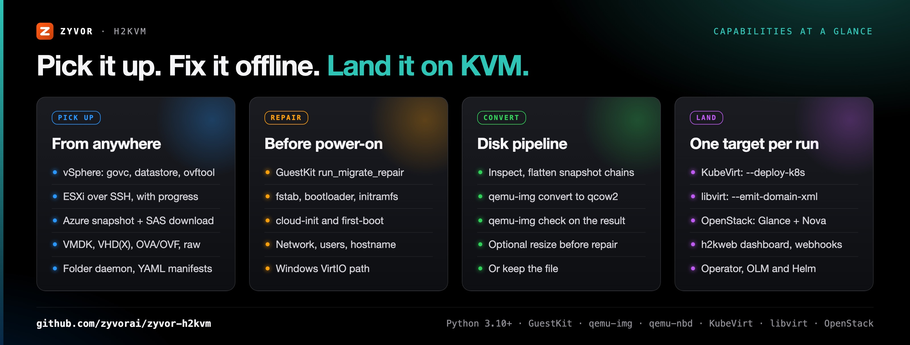
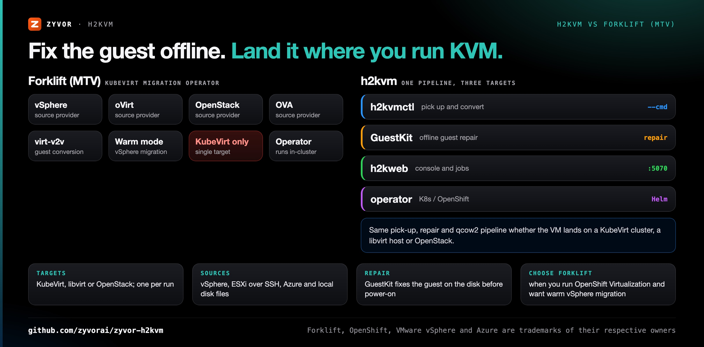
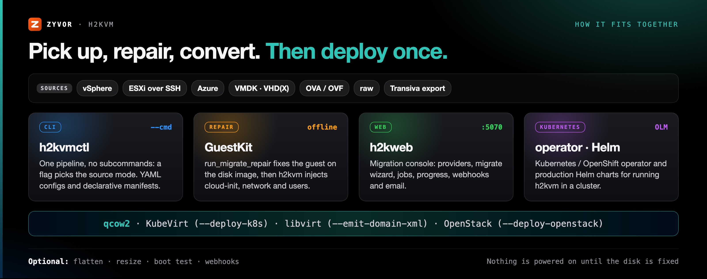

<div align="center">

# h2kvm

[](https://github.com/zyvorai/zyvor-h2kvm/releases/latest)
[](https://pypi.org/project/zyvor-guestkit/)
[](https://www.python.org/)
[](LICENSE)

[](https://zyvor.dev/schedule?utm_source=github&utm_medium=h2kvm&utm_campaign=readme_hero)
[](https://zyvor.dev/poc?utm_source=github&utm_medium=h2kvm&utm_campaign=readme_hero)
[](#quickstart)


### Any hypervisor to KVM. Fixed before first boot.

**Convert offline. Fix the guest. Deploy with confidence.** Pick up VMs from **vSphere, ESXi, Azure**, or any disk you already have (**VMDK, VHDX, VDI, raw, OVA/OVF**), fix the guest offline, then land it on **KubeVirt, libvirt, or OpenStack**. Web control plane and Kubernetes operator included.

**Offline guest repair** · **vSphere · ESXi · Azure · local disks** · **qcow2 + `qemu-img check`** · **3 deploy targets** · **CLI · web · operator · Helm**

**First-boot science for hypervisor exit** · lands on KubeVirt (**[Zorvia](https://zyvor.dev/zorvia?utm_source=github&utm_medium=h2kvm&utm_campaign=readme_hero)** · **[Zeus OS](https://zyvor.dev/zeus-os?utm_source=github&utm_medium=h2kvm&utm_campaign=readme_hero)**), libvirt (**[Machina](https://zyvor.dev/machina?utm_source=github&utm_medium=h2kvm&utm_campaign=readme_hero)**) or OpenStack · part of the [Zyvor](https://zyvor.dev/?utm_source=github&utm_medium=h2kvm&utm_campaign=readme_hero) suite

**Production use needs a paid licence, and [pricing is public](https://zyvor.dev/pricing?utm_source=github&utm_medium=h2kvm&utm_campaign=readme_hero).** Free for evaluation, development and labs.

**[How it works](docs/how-it-works.md)** ·
**[Install](docs/install-and-quick-start.md#install)** ·
**[GuestKit](docs/guestkit-integration.md)** ·
**[Demos](docs/demos.md)** ·
**[Watch the demo](https://www.youtube.com/watch?v=lQP1sd5Ftkc)** ·
**[CE vs Enterprise](#community-vs-enterprise)** ·
**[Docs](docs/README.md)** ·
**[Product](https://zyvor.dev/h2kvm?utm_source=github&utm_medium=h2kvm&utm_campaign=readme_hero)**

</div>

---

## Why h2kvm

Hypervisor exit fails when the bootloader is wrong, or Windows still points at the old hypervisor, **after** you cut over. h2kvm picks up a disk from wherever the VM lives today, repairs the guest **offline** so it boots on KVM the first time, converts it to qcow2, and hands it to **one** deploy target. Nothing is powered on until the disk is fixed.

| When this happens… | h2kvm gives you… |
|---|---|
| The exit is planned as an 18-month "migration project" | One pipeline: browse → migrate → deploy |
| Guest drivers break on first KVM boot | **GuestKit** offline fix for 35+ OS versions |
| Windows needs a war room of tribal scripts | Automated VirtIO / hivex / RDP path |
| No visibility mid-conversion | **h2kweb** progress · webhooks · email |
| K8s teams are stuck on libvirt YAML | Libvirt → **KubeVirt** one-click path |
| Cutover outcomes are unowned | Enterprise: SLA, LTS and CVE under contract, plus PowerShell runbooks |



<table>
<tr>
<td valign="top" width="33%">
<b>Pick up from anywhere</b><br>
vSphere (govc, datastore, ovftool), ESXi over SSH, Azure, or any VMDK, VHD(X), OVA/OVF or raw file.<br>
<a href="docs/how-it-works.md#where-disks-come-from">Where disks come from</a>
</td>
<td valign="top" width="33%">
<b>Repair offline</b><br>
GuestKit fixes fstab, bootloader, initramfs and hypervisor-aware config before power-on; h2kvm injects cloud-init, first-boot, network, user, service and hostname config.<br>
<a href="docs/guestkit-integration.md">GuestKit in h2kvm</a>
</td>
<td valign="top" width="33%">
<b>Convert and check</b><br>
<code>qemu-img convert</code> to qcow2, then <code>qemu-img check</code> on the result. Or keep the file.<br>
<a href="docs/how-it-works.md#what-happens-to-the-disk">What happens to the disk</a>
</td>
</tr>
<tr>
<td valign="top" width="33%">
<b>Land it on KVM</b><br>
KubeVirt (<code>--deploy-k8s</code>), libvirt (<code>--emit-domain-xml</code>) or OpenStack (<code>--deploy-openstack</code>). One target per run.<br>
<a href="docs/how-it-works.md#where-the-vm-lands">Where the VM lands</a>
</td>
<td valign="top" width="33%">
<b>Web dashboard</b><br>
The h2kweb dashboard shows progress, with webhooks and email.<br>
<a href="docs/install-and-quick-start.md#quick-start">Quick start</a>
</td>
<td valign="top" width="33%">
<b>Operator and Helm</b><br>
A Kubernetes / OpenShift operator and production Helm charts.<br>
<a href="docs/install-and-quick-start.md#quick-start">Surfaces</a>
</td>
</tr>
</table>

---

## h2kvm vs Forklift (MTV)



| | **h2kvm** | **Forklift / Migration Toolkit for Virtualization** |
|---|---|---|
| Deploy targets | KubeVirt, a libvirt host or OpenStack, one per run | KubeVirt (OpenShift Virtualization) |
| Sources | vSphere (govc, datastore, ovftool), ESXi over SSH, Azure, local VMDK / VHD(X) / OVA / OVF / raw files | Source providers such as vSphere, oVirt, OpenStack and OVA |
| Guest conversion | GuestKit `run_migrate_repair` on the disk image, then h2kvm injectors | virt-v2v |
| Output | qcow2, checked with `qemu-img check`; or keep the file | Disks imported into the cluster |
| Where it runs | CLI on a Linux host, h2kweb console, or the Kubernetes / OpenShift operator | An operator inside the cluster |
| Outside Kubernetes | Same pipeline to libvirt (`virsh define`) or OpenStack (Glance, Nova) | Kubernetes only |
| **Choose Forklift when** | | You run OpenShift Virtualization, want warm migration from vSphere, and want the migration tool that ships with that platform |

h2kvm is a converter, not a VM platform: it has no API link to Zorvia, Zeus OS or Machina. It deploys to the cluster or host; those products run or manage that endpoint afterwards.

---

<a id="see-it-in-action"></a>

## See it live

<div align="center">


<sub>Dashboard: getting-started checklist, start a migration, and migration counts.</sub>


<sub>Migrate: start from a provider VM or a disk image, or open a built-in preset.</sub>


<sub>Providers: connect vSphere, Azure or AWS to discover VMs.</sub>

</div>

**Demos:** [live console tour](https://www.youtube.com/watch?v=lQP1sd5Ftkc) · [full tutorial](https://www.youtube.com/watch?v=SF8N7gFPS0Q) · [feature deep dive](https://www.youtube.com/watch?v=etel7HPgm-U) · [all demos](docs/demos.md)

---

<a id="how-it-works"></a>

## How it fits together



<div align="center">

<picture>
  <source media="(prefers-color-scheme: dark)" srcset="docs/social/h2kvm-flow-dark.svg">
  
</picture>

</div>

1. **Pick up.** Extract an OVA or VHD, or download the disk, then discover the disk files.
2. **Inspect and flatten.** VMDKs are inspected first. `--flatten` merges a snapshot chain into one working image.
3. **Repair offline.** [GuestKit](docs/guestkit-integration.md) runs `run_migrate_repair` on the disk image, then h2kvm injects cloud-init, first-boot, network, user, service and hostname config.
4. **Convert and check.** `qemu-img convert` to qcow2, then `qemu-img check` on the result.
5. **Deploy, or stop.** Hand the qcow2 to one target, or keep the file.

Sources, the disk pipeline and every target in detail: [docs/how-it-works.md](docs/how-it-works.md).

---

<a id="install"></a>
<a id="quick-start"></a>
<a id="60-second-quick-start"></a>

## Quickstart

```bash
pip install "h2kvm[guestkit]==1.4.0"

# Local VMDK → qcow2 (GuestKit repair is the default backend)
h2kvmctl --cmd local --vmdk ubuntu.vmdk --to-output ubuntu.qcow2 --backend guestkit

# vSphere → repair → KubeVirt (there are no subcommands; --cmd picks the mode)
h2kvmctl --cmd vsphere --vcenter vc.example.com --vc-user admin \
  --vc-password-env VC_PASSWORD --vs-vm web-prod-01 \
  --output-dir ./out --to-output web-prod-01.qcow2 --flatten \
  --deploy-k8s --k8s-namespace vms
```

Host needs Linux with `qemu-img`, `qemu-nbd`, and `losetup`. More: [install, artifacts and surfaces](docs/install-and-quick-start.md) · [remote lab deploy](docs/remote-lab-deploy.md) · [GuestKit](docs/guestkit-integration.md).

<a id="guestkit"></a>
<a id="remote-lab-deploy"></a>

---

<a id="community-vs-enterprise"></a>

## Community vs Enterprise

**Community proves convert. Enterprise owns cutover night.**

CE is for labs and single-cluster PoC. Moving a Windows estate, SAN-backed waves, or multi-site fleets? No war-room, no HA fabric, no LTS/CVE contract on CE. **Buy Enterprise.**

The comparison table, **why teams upgrade** and the full feature matrix are in [docs/ce-vs-enterprise.md](docs/ce-vs-enterprise.md).

<div align="center">

**Bring us your worst wave.** 30-day PoC on your estate.

</div>

<a id="why-teams-upgrade"></a>

## Documentation

| Topic | Doc |
|---|---|
| Every document | [docs/README.md](docs/README.md) · [docs/index.md](docs/index.md) |
| Sources, disk pipeline and targets | [docs/how-it-works.md](docs/how-it-works.md) |
| Install, artifacts and surfaces | [docs/install-and-quick-start.md](docs/install-and-quick-start.md) |
| GuestKit wiring | [docs/guestkit-integration.md](docs/guestkit-integration.md) · [docs/architecture/GUESTKIT.md](docs/architecture/GUESTKIT.md) |
| Remote SSH deploy | [docs/remote-lab-deploy.md](docs/remote-lab-deploy.md) · [docs/deployment/deploy-remote.md](docs/deployment/deploy-remote.md) |
| Editions | [docs/ce-vs-enterprise.md](docs/ce-vs-enterprise.md) |
| Examples | [examples/](examples/) |

## Support

| | |
|---|---|
| **Enterprise / PoC** | [Book a demo](https://zyvor.dev/schedule?utm_source=github&utm_medium=h2kvm&utm_campaign=readme_footer) · [30-day PoC](https://zyvor.dev/poc?utm_source=github&utm_medium=h2kvm&utm_campaign=readme_footer) · [sales@zyvor.dev](mailto:sales@zyvor.dev) |
| **Community** | [GitHub Issues](https://github.com/zyvorai/zyvor-h2kvm/issues) |
| **Product** | [zyvor.dev/h2kvm](https://zyvor.dev/h2kvm?utm_source=github&utm_medium=h2kvm&utm_campaign=readme_footer) |

---

## Maturity

The source table in [docs/how-it-works.md](docs/how-it-works.md#where-disks-come-from) states what is implemented:

| Source or target | Status |
|---|---|
| vSphere (govc, datastore, ovftool), ESXi over SSH, Azure, local files, folder daemon and manifests | Implemented (ovftool is an external binary) |
| Nutanix AHV | Via [Transiva](https://github.com/zyvorai/zyvor-transiva), then `--cmd local` |
| AWS, Proxmox Backup Server | Library modules only, not reachable from the CLI |
| GCP, Xen, VirtualBox, remote Hyper-V | No pickup code; their disk files (VDI, VHDX) work as local files |
| OpenStack deploy | Implemented; a failed Glance or Nova step is logged and the run still succeeds by default |

---

<a id="where-this-fits-the-zyvor-suite"></a>

## Part of the Zyvor stack

GuestKit and h2kvm fix the disk and land the VM. Where it lands decides the Zyvor product you run it on: KubeVirt is [Zorvia](https://zyvor.dev/zorvia?utm_source=github&utm_medium=h2kvm&utm_campaign=readme_suite) and [Zeus OS](https://zyvor.dev/zeus-os?utm_source=github&utm_medium=h2kvm&utm_campaign=readme_suite), libvirt hosts are [Machina](https://zyvor.dev/machina?utm_source=github&utm_medium=h2kvm&utm_campaign=readme_suite). The full role table is in [docs/zyvor-suite.md](docs/zyvor-suite.md).

| Product | Role next to h2kvm |
|---|---|
| **h2kvm** | Any hypervisor to KVM: pick up, repair offline, convert, deploy |
| **[GuestKit](https://github.com/zyvorai/zyvor-guestkit)** | The offline repair engine h2kvm calls (`h2kvm[guestkit]`, `run_migrate_repair`) |
| **[Transiva](https://github.com/zyvorai/zyvor-transiva)** | Exports VMs (including Nutanix AHV); feed its file to `--cmd local` |
| **[Zorvia](https://github.com/zyvorai/zyvor-zorvia)** | KubeVirt VM platform where `--deploy-k8s` VMs keep running; no API link from h2kvm |
| **[Machina](https://zyvor.dev/machina?utm_source=github&utm_medium=h2kvm&utm_campaign=readme_suite)** | Control plane for the libvirt hosts `--emit-domain-xml` lands on |

<div align="center">

<picture>
  <source media="(prefers-color-scheme: dark)" srcset="docs/social/migration-1200x630-dark.png">
  
</picture>

</div>

**VMware to KubeVirt on Zorvia:** [Transiva](https://github.com/zyvorai/zyvor-transiva) (export, Apache-2.0) → h2kvm (convert and deploy, Zyvor Production License) → GuestKit (assure, Apache-2.0) → [Zorvia](https://github.com/zyvorai/zyvor-zorvia/blob/main/docs/leave-openshift.md) to operate. Each is a separate tool with its own licence; h2kvm needs a paid licence for production use. Zorvia's own importer is Experimental, so use this suite.

→ [zyvor.dev](https://zyvor.dev)

---

## License

h2kvm is source-available under the **[Zyvor Production License v1.0](LICENSE)** (SPDX `LicenseRef-Zyvor-Production-1.0`).

- **Free** for development, testing, evaluation, research, education, and non-production labs.
- **Production use** (customer workloads, SaaS, managed services, OEM, redistribution, and other revenue-generating use) requires an annual enterprise subscription. Plans, support levels and terms: [docs/SUBSCRIPTION-MODEL.md](docs/SUBSCRIPTION-MODEL.md) · [licensing](docs/LICENSING.md) · [licensing model](docs/legal/LICENSING-MODEL.md) · [Pricing](https://zyvor.dev/pricing?utm_source=github&utm_medium=h2kvm&utm_campaign=readme_license) · [sales@zyvor.dev](mailto:sales@zyvor.dev).

Commercial terms are issued separately: [https://zyvor.dev](https://zyvor.dev?utm_source=github&utm_medium=h2kvm&utm_campaign=readme_footer). New quotes follow an annual enterprise subscription model (see `docs/SUBSCRIPTION-MODEL.md`); the figures below apply to existing agreements. Published prices: **$100 per VM, one-time** (N × $100), or Enterprise at a fixed price — **$25,000/year**, **$2,500/month**, **$25,000** for one major version, or **$15,000** for one minor version. Contact [sales@zyvor.dev](mailto:sales@zyvor.dev) for custom pricing. See [COMMERCIAL_LICENSE.md](COMMERCIAL_LICENSE.md) and [docs/LICENSING.md](docs/LICENSING.md).

Contributions: [CLA.md](CLA.md) + [DCO.md](DCO.md) (`git commit -s`); see [CONTRIBUTING.md](CONTRIBUTING.md). New source files need the `LicenseRef-Zyvor-Production-1.0` SPDX header. Report vulnerabilities privately per [SECURITY.md](SECURITY.md).

---

<div align="center">

### Bring us your worst wave

[](https://zyvor.dev/schedule?utm_source=github&utm_medium=h2kvm&utm_campaign=readme_footer)
[](https://zyvor.dev/poc?utm_source=github&utm_medium=h2kvm&utm_campaign=readme_footer)
[](https://zyvor.dev/pricing?utm_source=github&utm_medium=h2kvm&utm_campaign=readme_footer)
[](mailto:sales@zyvor.dev?subject=h2kvm)
[](https://github.com/zyvorai/zyvor-h2kvm)

<sub>Built by <a href="https://zyvor.dev?utm_source=github&utm_medium=h2kvm&utm_campaign=readme_colophon">Zyvor AI Labs</a> · Hypervisor exit without the 2 a.m. surprise</sub>

</div>
